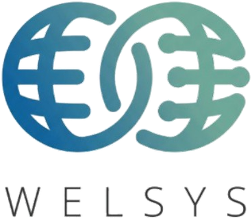
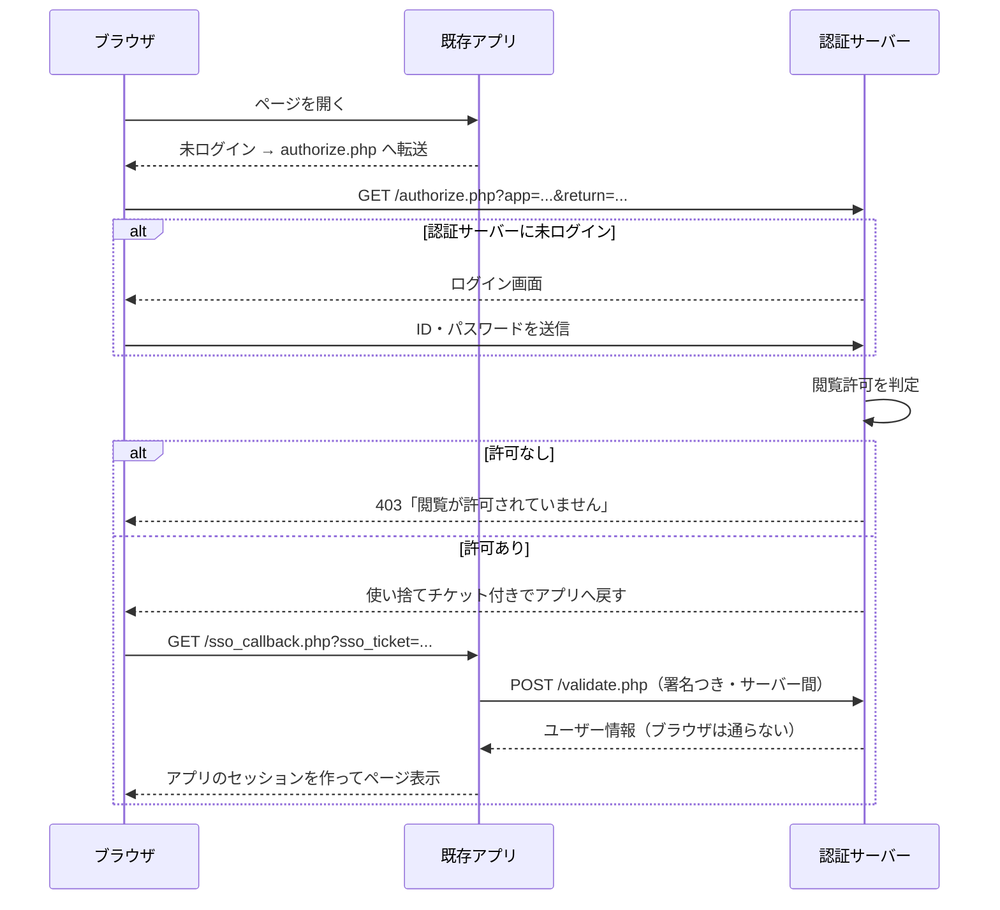

# User Management — 共通ユーザーデータベースとシングルサインオン

複数のウェブアプリケーションでバラバラに管理していたユーザーIDとパスワードを、
**PHP + MySQL の共通ユーザーデータベース1つ**にまとめ、
利用者は **1組のID・パスワードだけ**で許可された全アプリを使えるようにする仕組みです。

稼働中のアプリを止める必要はありません。まず認証サーバーを別に立ち上げ、
準備のできたアプリから1つずつ順番に切り替えられます。

---

## できること

| | 内容 |
|---|---|
| ユーザーの追加・削除 | 管理画面から1件ずつ、または CSV でまとめて登録・更新 |
| 閲覧許可・拒否 | アプリごとに、ユーザー単位で許可／拒否を設定。権限マトリクスで一括変更 |
| シングルサインオン | 一度ログインすれば、許可された他のアプリには再入力なしで入れる |
| 一括ログアウト | どれか1つでログアウトすると、全アプリのログイン状態が切れる |
| 即時の失効 | 権限を外す・アカウントを停止すると、ログイン中の利用者も短時間で締め出される |
| 監査ログ | ログイン、権限変更、ユーザーの追加・削除をすべて記録 |
| 既存IDとの共存 | アプリが元々持っているユーザーIDと対応付けられるので、アプリ側のDBは作り直さなくてよい |

---

## 全体構成

```
                          ┌──────────────────────────────┐
    ブラウザ  ──────────▶ │  認証サーバー (auth.example.com) │
        │                 │   ・ログイン画面                │
        │                 │   ・User Management 管理画面    │
        │                 │   ・共通ユーザーDB (MySQL)      │
        │                 └──────────────────────────────┘
        │                              ▲
        │                              │ サーバー間通信（チケット引き換え）
        ▼                              │
  ┌───────────────┐   ┌───────────────┐   ┌───────────────┐
  │  既存アプリA   │   │  既存アプリB   │   │  既存アプリC   │
  │  sso_guard.php │   │  sso_guard.php │   │  （未対応でも  │
  │                │   │                │   │    そのまま可） │
  └───────────────┘   └───────────────┘   └───────────────┘
```

利用者の情報はURLに載せません。アプリはブラウザ経由で**使い捨てのチケット**だけを受け取り、
それを裏側のサーバー間通信で引き換えて初めてユーザー情報を得ます。

<details>
<summary>ログインの流れ（詳細）</summary>


</details>

---

## 動作環境

- PHP 8.1 以上（`pdo_mysql` / `mbstring` / `json`。`curl` があれば使用）
- MySQL 5.7.8 以上 または MariaDB 10.2 以上
- 本番環境では **HTTPS 必須**（Cookie を Secure 属性で発行するため）

---

## セットアップ

### 1. データベースを用意する

```sql
CREATE DATABASE welsys_sso DEFAULT CHARACTER SET utf8mb4 COLLATE utf8mb4_unicode_ci;
CREATE USER 'welsys_sso'@'localhost' IDENTIFIED BY '（強固なパスワード）';
GRANT SELECT, INSERT, UPDATE, DELETE ON welsys_sso.* TO 'welsys_sso'@'localhost';
```

### 2. 設定ファイルを作る

```bash
cd sso
cp config.sample.php config.php
vi config.php      # db の接続情報と base_url を自分の環境に合わせる
```

`base_url` には、`sso/public/` を公開するURL（例 `https://auth.example.com`）を末尾スラッシュ無しで書きます。

### 3. テーブルを作り、最初の管理者を登録する

```bash
php bin/install.php
```

対話形式で管理者のログインIDとパスワードを尋ねられます。引数でも指定できます。

```bash
php bin/install.php --username=admin --password='＊＊＊＊＊＊＊＊' --name='システム管理者'
```

> `bin/install.php` はテーブルを作成するため `CREATE` 権限が必要です。
> DBユーザーに CREATE を与えたくない場合は、`mysql -u root -p welsys_sso < schema.sql` を先に実行し、
> そのうえで `bin/install.php` を動かしてください（既存テーブルはそのまま使われます）。

### 4. ウェブサーバーの公開先を `sso/public/` に向ける

**`sso/public/` より上の階層（`config.php` や `lib/`）を絶対に公開しないでください。**

Apache（バーチャルホスト）の例：

```apache
<VirtualHost *:443>
    ServerName auth.example.com
    DocumentRoot /var/www/sso/public
    <Directory /var/www/sso/public>
        AllowOverride None
        Require all granted
    </Directory>
    # SSL 設定は環境に合わせて
</VirtualHost>
```

nginx の例：

```nginx
server {
    server_name auth.example.com;
    root /var/www/sso/public;
    index index.php;

    location / { try_files $uri $uri/ /index.php?$query_string; }
    location ~ \.php$ {
        include fastcgi_params;
        fastcgi_pass unix:/run/php/php-fpm.sock;
        fastcgi_param SCRIPT_FILENAME $document_root$fastcgi_script_name;
    }
}
```

### 5. 期限切れデータの掃除を cron に登録する（任意）

```cron
0 4 * * * php /var/www/sso/bin/gc.php > /dev/null 2>&1
```

---

## 既存アプリを SSO に対応させる

### ステップ1：アプリを登録する

管理画面 → **アプリ** → 「＋ アプリを登録」。
アプリ名・識別子（例 `lyrics`）・URL を入れて保存すると、
そのアプリに貼り付ける設定内容がその場で表示されます。

コマンドラインからでも登録できます。

```bash
php bin/register_app.php --key=lyrics --name='Music Lyrics' --url=https://lyrics.example.com
```

### ステップ2：アプリ側にファイルを置く

`sso/client/` の中身をアプリのサーバーにコピーします。

```
（アプリのドキュメントルート）/
├── sso/
│   ├── SsoClient.php      ← client/SsoClient.php
│   ├── sso_guard.php      ← client/sso_guard.php
│   └── sso_config.php     ← 管理画面が表示した内容を貼り付け（公開厳禁）
├── sso_callback.php       ← client/sso_callback.php（require のパスを sso/ に直す）
└── sso_logout.php         ← client/sso_logout.php（同上）
```

### ステップ3：保護したいページの先頭に1行足す

```php
<?php require __DIR__ . '/sso/sso_guard.php'; ?>
```

これだけです。未ログインなら認証サーバーへ飛び、閲覧許可の確認まで済ませて戻ってきます。
ページの中では `$SSO_USER` が使えます。

```php
<?php require __DIR__ . '/sso/sso_guard.php'; ?>

こんにちは、<?= htmlspecialchars($SSO_USER['display_name']) ?> さん
（ログインID: <?= htmlspecialchars($SSO_USER['username']) ?>）
```

| キー | 内容 |
|---|---|
| `username` | 全アプリ共通のログインID |
| `display_name` / `department` / `email` | 氏名・所属・メール |
| `is_admin` | 管理者かどうか |
| `external_user_id` | **そのアプリが元々持っているユーザーID**（対応付けた場合） |

---

## 稼働中のアプリを止めずに移行する

いきなり全部を切り替える必要はありません。次の順番で進めるのが安全です。

1. **認証サーバーだけ先に立てる。**
   この時点では既存アプリは何も変わりません。今までどおり動き続けます。

2. **共通ユーザーデータベースに利用者を登録する。**
   既存アプリのユーザー一覧を CSV に整えて、管理画面の「CSV一括登録」で流し込みます。
   `apps` 列に、そのユーザーが使ってよいアプリの識別子を `|` 区切りで書けば、
   登録と権限付与が同時に終わります。

3. **既存IDとの対応付けをする（アプリ側のDBを作り直さないための要）。**
   アプリが自前のユーザーテーブルを持っている場合、
   管理画面の「ユーザーの編集 → アプリの閲覧許可 → アプリ内のユーザーID」に、
   そのアプリ内でのIDを入れておきます。
   アプリ側では次のように受け取れるので、既存のデータ構造をそのまま使い続けられます。

   ```php
   require __DIR__ . '/sso/sso_guard.php';

   $localUserId = $SSO_USER['external_user_id'] ?? null;
   if ($localUserId === null) {
       // 初回だけ、アプリ側のユーザー行を作る／既存行に紐づける
   }
   $me = findLocalUser($localUserId);   // 以降は今までのコードのまま
   ```

4. **アプリを1つ選んで切り替える。**
   `sso_guard.php` を入れて動作を確認します。問題があれば `require` の1行を外すだけで元に戻せます。

5. **順次、残りのアプリを切り替える。**
   全部が済んだら、各アプリの独自ログイン画面とパスワード欄を撤去します。

> 移行中はパスワードが二重管理になります。混乱を避けるため、
> 切り替えたアプリの独自ログイン画面は早めに閉じてください。

---

## 日々の運用

### ユーザーを追加する
管理画面 → **ユーザー** → 「＋ ユーザーを追加」。
初期パスワードを設定し、「次回ログイン時にパスワードの変更を求める」を有効にしておくと、
本人が最初のログインで自分のパスワードに変更します。

### ユーザーをまとめて登録する
管理画面 → **ユーザー** → 「CSV一括登録」。

```csv
username,display_name,department,email,password,status,is_admin,apps
y.suzuki,鈴木 陽子,営業,y.suzuki@example.com,Initial#2026pw,active,0,lyrics|kintai
k.sato,佐藤 健,総務,k.sato@example.com,Initial#2026pw,active,0,*
```

- 実行前に必ず内容の確認画面が出ます。エラー行があるうちは実行できません
- 既存のログインIDは「更新」になります（`password` 列が空なら現在のパスワードのまま）
- `apps` 列が空の行は、権限を変更しません
- Excel が出力する Shift_JIS の CSV もそのまま読み込めます

### 閲覧の許可・拒否を変える
- 1人ずつ：**ユーザー** → 対象を開く → 「アプリの閲覧許可」
- まとめて：**権限マトリクス** → 一覧のセルを変更して保存、
  または「一括設定」で検索結果全員へ一度に適用

「既定」は各アプリの既定ポリシーに従います。
アプリの既定ポリシーは2種類です。

| 既定ポリシー | 意味 |
|---|---|
| 許可した人のみ（推奨） | 個別に「許可」した人だけが入れる |
| 全員に許可 | 個別に「拒否」した人以外は全員入れる（全社共通の掲示板など） |

### 退職者の扱い
- **一時的に止める**：状態を「停止中」に。ログイン中の端末もその場で締め出されます。あとで戻せます
- **完全に消す**：ユーザー一覧の「削除」。権限やセッションも一緒に消えます（元に戻せません）

削除・停止のどちらでも、監査ログには記録が残ります。

---

## セキュリティ上の作り

| 項目 | 対応 |
|---|---|
| パスワード保存 | `password_hash()`（bcrypt/Argon2）。平文は保存しない。アルゴリズムが古くなったら次回ログイン時に自動で貼り替え |
| 総当たり対策 | 既定で5回失敗すると15分ロック。存在しないIDでも同じ応答時間・同じ文言を返す |
| セッション | トークンは `random_bytes(32)`。DBには sha256 のみ保存。Cookie は HttpOnly / Secure / SameSite=Lax |
| セッションの寿命 | 無操作30分・最長12時間（`config.php` で変更可） |
| チケット | 1回限り・既定60秒で失効。アプリと戻り先URLに紐づく。二重使用・別アプリでの引き換えは拒否 |
| サーバー間通信 | アプリ識別子＋共有秘密鍵の HMAC-SHA256 署名。秘密鍵はブラウザを一切通らない |
| オープンリダイレクト | 戻り先は登録済みアプリのURL配下のみ許可。それ以外は 400 で停止 |
| SQL インジェクション | 全クエリでプリペアドステートメント（エミュレーション無効） |
| XSS | 出力はすべて `htmlspecialchars()` 経由 |
| CSRF | 管理画面の全 POST にトークン検証 |
| セッション固定 | ログイン確定時に認証サーバー側・アプリ側の双方で ID を再生成 |
| 権限の即時反映 | アプリは既定60秒ごとに認証サーバーへ有効性を再確認。権限剥奪・停止がすぐ効く |

---

## ファイル構成

```
sso/
├── README.md               この文書
├── schema.sql              MySQL のテーブル定義
├── config.sample.php       設定ファイルのひな形（config.php にコピーして使う）
├── lib/                    ※公開しないこと
│   ├── bootstrap.php       共通初期化
│   ├── Config.php  Db.php  設定・DB接続
│   ├── Auth.php            ログイン、セッション、ロック
│   ├── Users.php           ユーザーの追加・更新・削除
│   ├── Apps.php            アプリ登録、既存IDとの対応付け
│   ├── Permissions.php     閲覧許可の判定と一括設定
│   ├── Tickets.php         使い捨てチケット
│   ├── Audit.php           監査ログ
│   ├── Csrf.php  View.php  CSRF・画面の共通枠
│   └── helpers.php
├── public/                 ← ここをドキュメントルートにする
│   ├── login.php  logout.php  password.php  index.php
│   ├── authorize.php       SSO の入口（アプリはここへ利用者を送る）
│   ├── validate.php        チケット引き換え・有効性確認（サーバー間, JSON）
│   ├── assets/             スタイルとロゴ
│   └── admin/              User Management 管理画面
│       ├── index.php users.php user_edit.php users_import.php
│       └── apps.php app_edit.php permissions.php logs.php
├── client/                 ← 既存アプリ側に置くファイル
│   ├── SsoClient.php  sso_guard.php  sso_callback.php  sso_logout.php
│   ├── sso_config.sample.php
│   └── example/            組み込みサンプル
└── bin/
    ├── install.php         初期セットアップ
    ├── register_app.php    アプリ登録
    └── gc.php              期限切れデータの掃除（cron 用）
```

---

## 動作確認について

PHP 8.4 + MariaDB 10.11 で、認証サーバーとアプリ2つを別ポートで起動し、
次の項目が期待どおりに動くことを確認済みです。

- 未ログイン時の転送 → ログイン → アプリへの復帰
- 2つ目のアプリに再ログインなしで入れること（シングルサインオン）
- 権限が無いユーザーの拒否（403）と、許可後のアクセス
- 権限を「拒否」に変更すると、ログイン中の利用者も締め出されること
- アカウント停止で全アプリから即座に締め出されること
- 初回ログイン時のパスワード変更の強制と、変更後の元ページへの復帰
- CSV 一括登録（不正行の検出・重複ID の検出・権限の同時付与）
- 1つのアプリでのログアウトが全アプリに及ぶこと
- ログイン失敗5回でのアカウントロック
- チケットの二重使用・他アプリによる横取り・署名偽装・戻り先URL偽装の拒否

---

## よくある質問

**Q. 認証サーバーとアプリが同じドメインでないと使えませんか。**
いいえ。別ドメインでも動きます。チケットを使う方式なので、Cookie をドメイン間で共有する必要がありません。

**Q. アプリ側のデータベースに手を入れる必要はありますか。**
基本的にありません。既存のユーザーテーブルは、`external_user_id` の対応付けでそのまま使えます。

**Q. 認証サーバーが止まったらどうなりますか。**
既にログイン済みの利用者は、アプリ側セッションの再確認が必要になるタイミング（既定60秒）まではそのまま使えます。
新規ログインはできません。認証サーバーは冗長化するか、復旧手順を用意しておいてください。

**Q. パスワードを忘れた利用者への対応は。**
管理画面の「ユーザーの編集 → パスワードの再設定」で仮パスワードを設定し、
「次回ログイン時に本人へ変更を求める」を有効にして本人に伝えてください。

**Q. 管理者を増やしたいのですが。**
ユーザーの編集で「管理者にする」を有効にします。
最後の1人の管理者は、削除も管理者権限の解除もできないよう保護されています。
